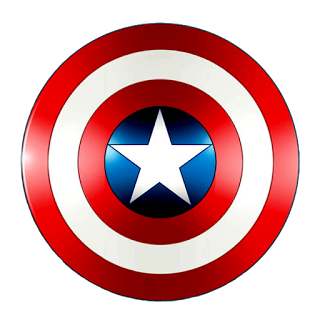

	
	<h1>Captain America Shield</h1>

<h2>:dart: Objective</h2>

The objective that project is training habilities with HTML and CSS drawing the captian america shield.

<h2>:hammer_and_wrench: Technologies</h2>

- [HTML](https://developer.mozilla.org/pt-BR/docs/Web/HTML)
- [CSS](https://developer.mozilla.org/pt-BR/docs/Web/CSS)

▶️ See application in production [here](https://renesena.github.io/captain-america-shield/)
